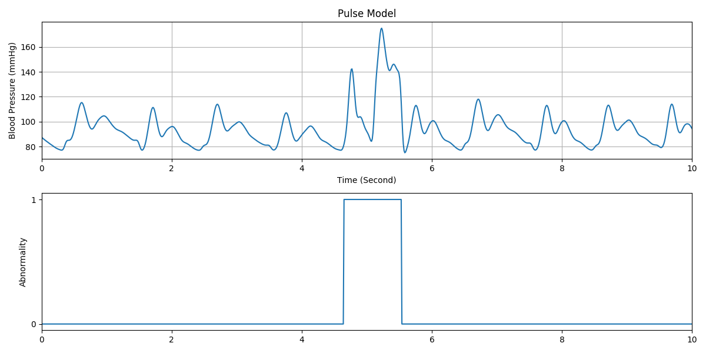

=====
pyPDA
=====

.. image:: https://img.shields.io/pypi/v/pypda.svg
        :target: https://pypi.python.org/pypi/pypda

.. image:: https://img.shields.io/travis/taoyilee/pypda.svg
        :target: https://travis-ci.com/taoyilee/pypda

.. image:: https://readthedocs.org/projects/pypda/badge/?version=latest
        :target: https://pypda.readthedocs.io/en/latest/?badge=latest
        :alt: Documentation Status

A Pythonic toolkit to generate synthetic blood pressure waveforms based on principle of pulse decomposition analysis (PDA).

* Free software: MIT license

Quick Start
-----------------

Use
~~~~~~~~~~~~~~~~
It is recommended that pyPDA should be setup in a Python `virtual environment <https://docs.python-guide.org/dev/virtualenvs/>`_.

.. code-block:: console

    python -m venv venv
    source venv/bin/activate
    pip install pyPDA
    pypda pulse --plot-dir work_dir --png # plot single beat waveform to word_dir

    # plot 10 second pulse waveform of 65 bpm, sampled at 90 Hz to word_dir
    pypda sample --bpm 65 --plot-dir work_dir --png --length 10 --sampling-rate 90

.. code-block:: python

    from pypda.pulse_model import PulseModelRaw

    pulse_waveform = PulseModelRaw()
    import matplotlib.pyplot as plt
    plt.plot(pulse_waveform.pulse_waveform)

    from pypda.wavelets import TriangGaussian
    triangular_pulse = TriangGaussian()
    triangular_pulse.shift(10) # optional horizontal shifting of waveform
    plt.plot(triangular_pulse.pulse_waveform)

    # addition operator is supported
    superpositioned_pulse = pulse_waveform + triangular_pulse
    plt.plot(superpositioned_pulse.pulse_waveform)

Development
~~~~~~~~~~~~~~~~~~~~~~~~
Please feel free to fork a copy on GitHUB. Pull requests are very welcome. To report an issue, please use `GitHub issue tracker <https://github.com/taoyilee/pyPDA/issues>`_.

.. code-block:: console

    python -m venv venv
    source venv/bin/activate
    git clone git@github.com:taoyilee/pyPDA.git
    pip install -r requirements_dev.txt
    # Start coding.

Screen Capture
---------------------
.. image:: docs/pulse.png
    :width: 400
    :alt: Sample blood pressure waveform

References
---------------------
1. Baruch, Martin C., et al. "Pulse decomposition analysis of the digital arterial pulse during hemorrhage simulation." Nonlinear biomedical physics 5.1 (2011): 1. `[PDF] <https://www.ncbi.nlm.nih.gov/pmc/articles/PMC3025935/pdf/1753-4631-5-1.pdf>`_
